# ✋ SignSense – Real-Time Hand Gesture Recognition

SignSense is a real-time computer vision application that detects hand gestures using a webcam. It uses **MediaPipe** and **OpenCV** to track hand landmarks and recognize gestures like **THUMBS UP**, **OK**, and finger counts.

---

## 📁 Project Structure

```
SignSense/
│
├── app.py               # Main gesture recognition script
│
├── Module/              # Folder for modular utilities
│   └── main.py          # Module script using shared logic
│
└── __pycache__/         # Auto-generated Python bytecode cache
```

---

## 🧠 About the Code

### ✅ `app.py`

The main logic for gesture detection:
- Uses the webcam to capture live video.
- Detects hand landmarks using **MediaPipe**.
- Counts fingers and recognizes gestures like:
  - ✊ **FIST**
  - ☝️ **ONE**
  - ✌️ **TWO**
  - 👍 **THUMBS UP**
  - 👌 **OK**
  - ✌️ **SUPER (V sign)**

#### Key Functions:
- `fingers_up()`: Returns which fingers are extended.
- `recognize_gesture()`: Returns gesture name based on finger state.
- `get_hand_label()`: Detects if it’s the right or left hand.

### 🧩 `Module/main.py`

This file is a placeholder for modular code. It can include:
- Gesture interpretation logic
- Hand-tracking utilities
- Interfaces to control other apps/devices

---

## 📸 Screenshots

| Screenshot | Screenshot | Screenshot |
|------------|------------|------------|
| 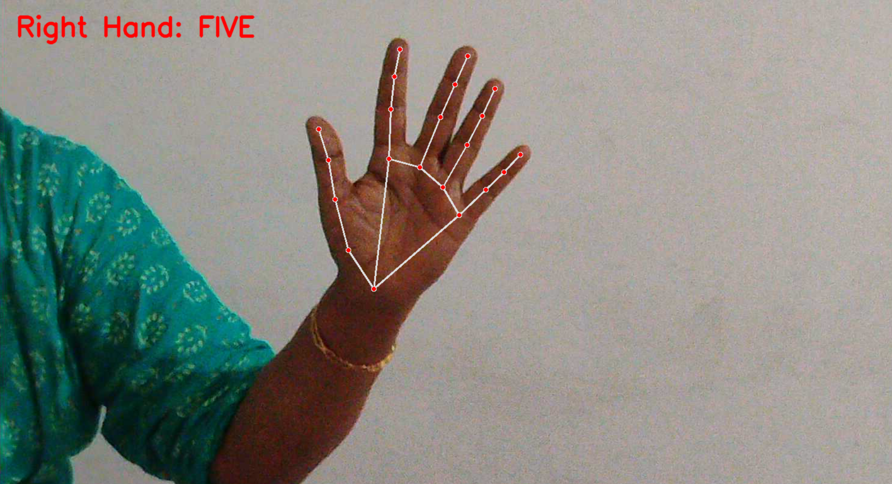 | 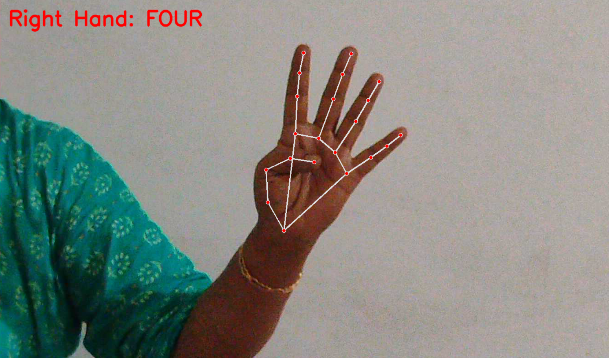 | 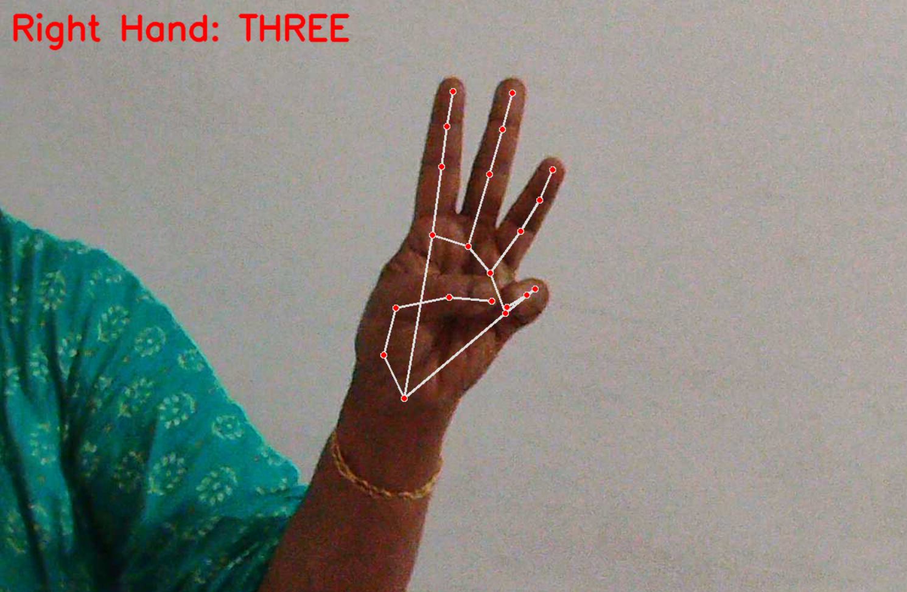 |
| 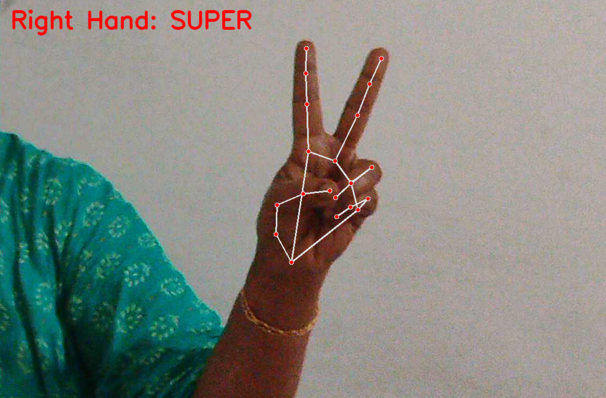 | 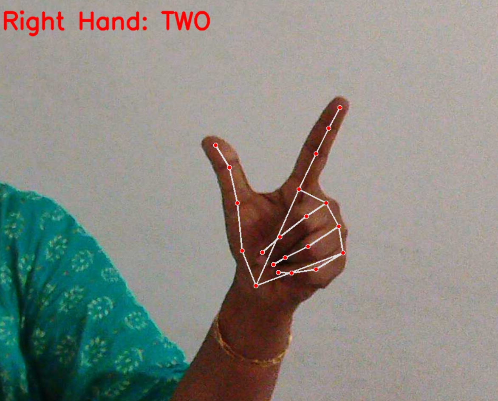 | 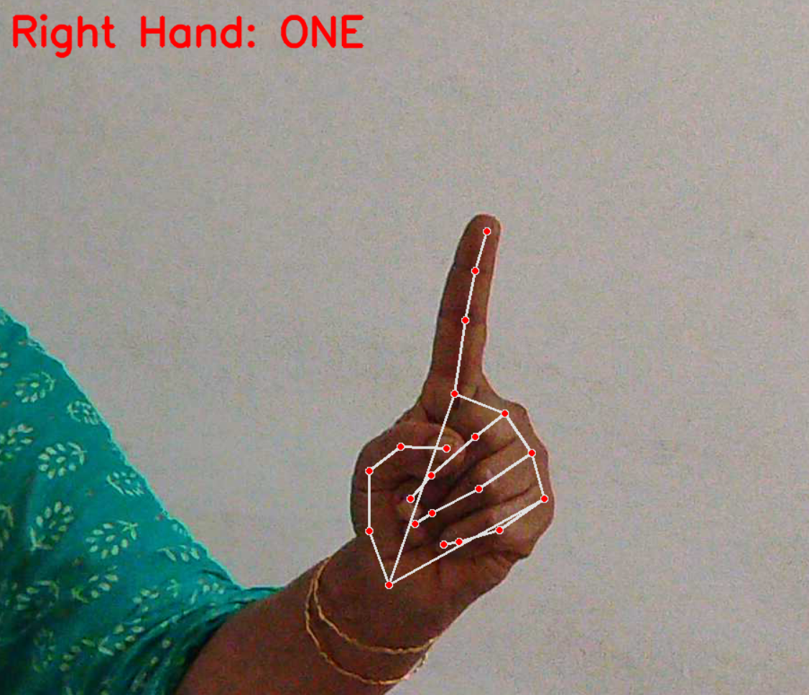 |
| 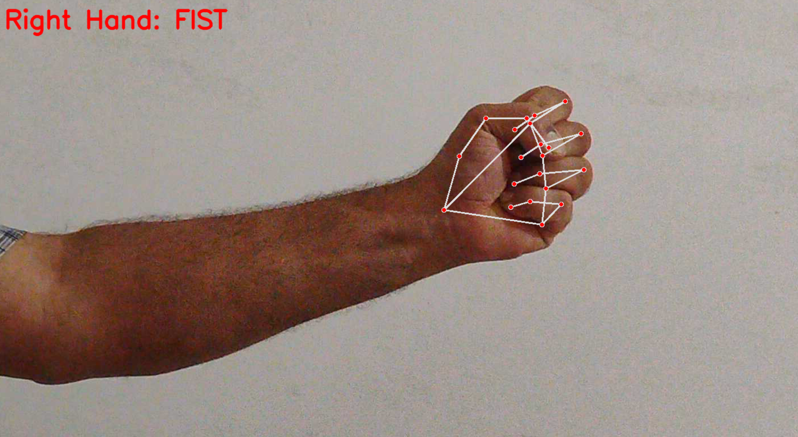 | 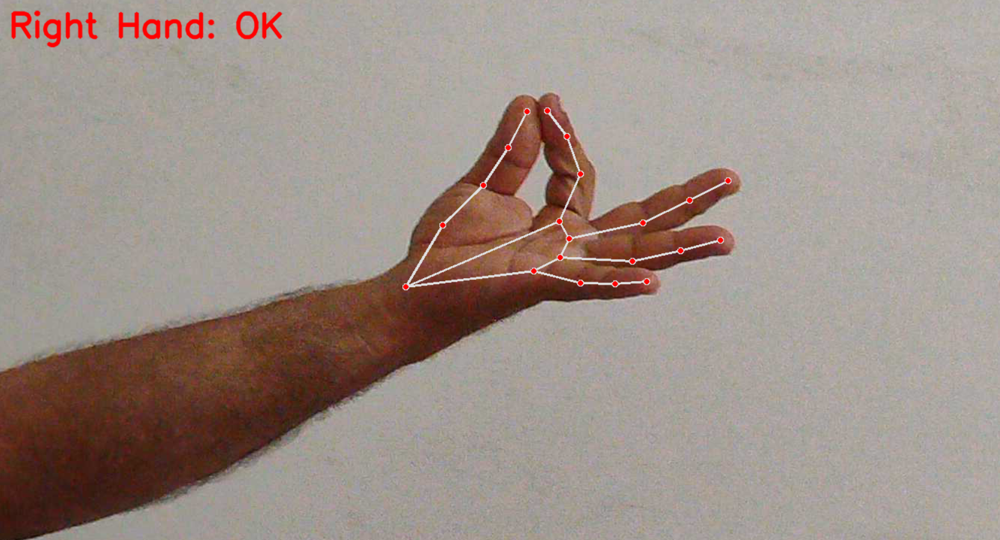 | 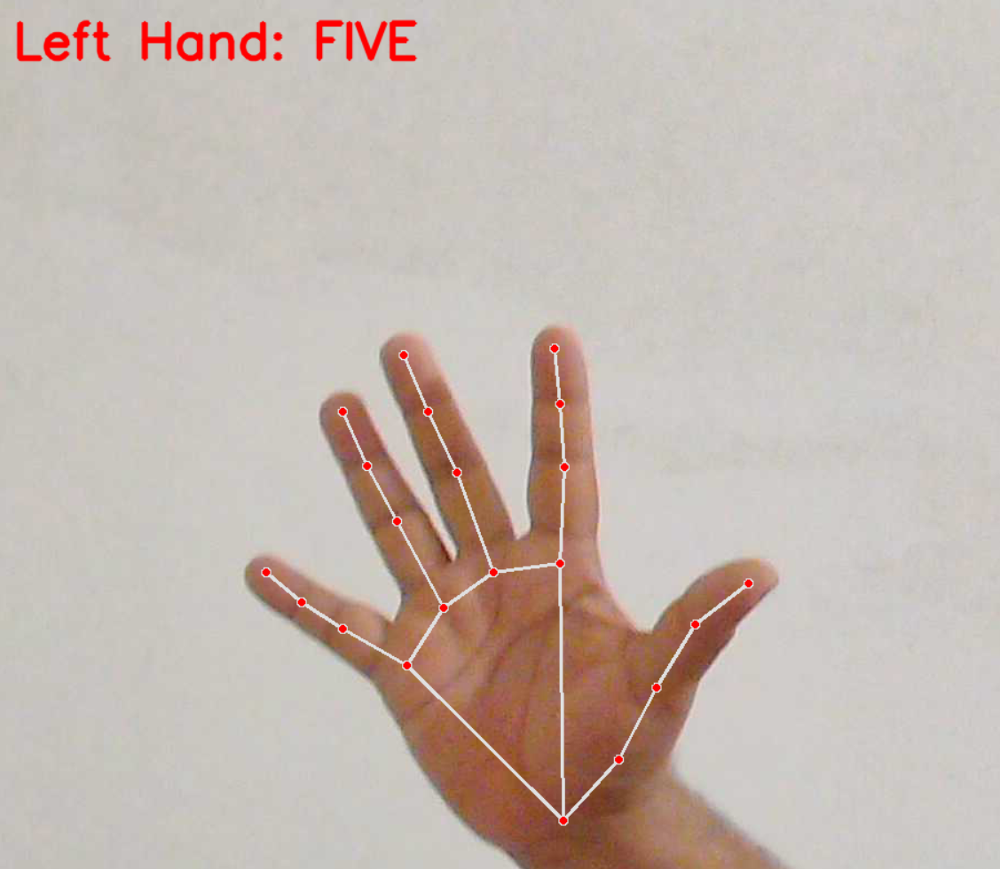 |
| 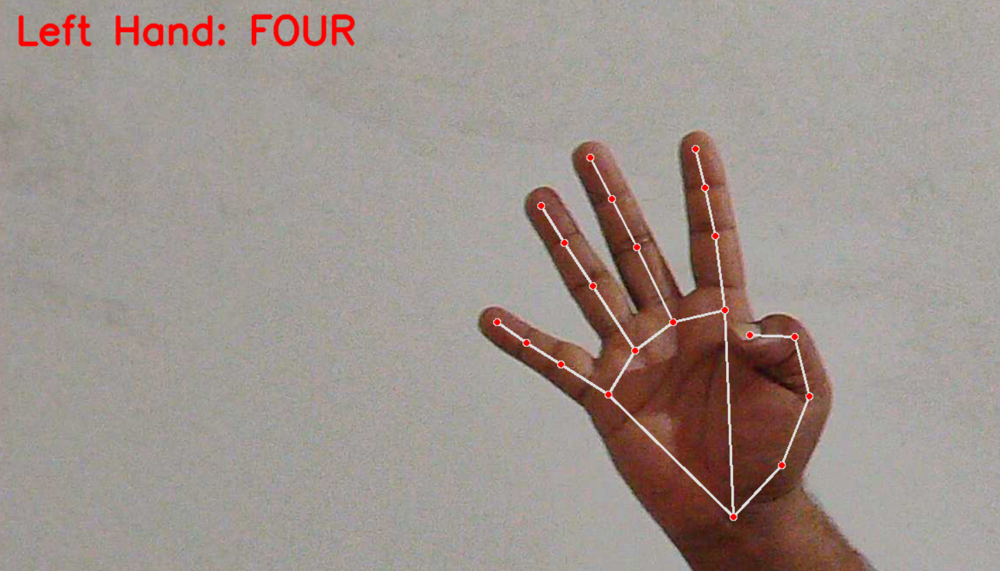 | 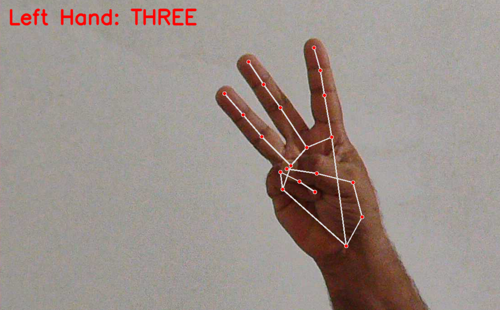 | 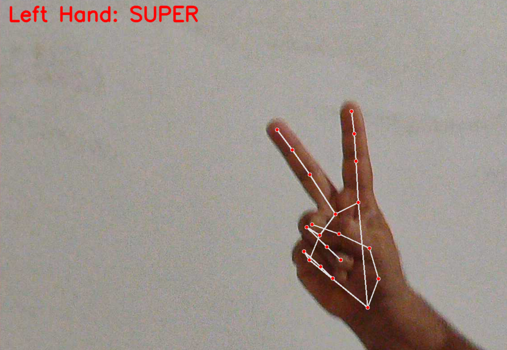 |
|  | 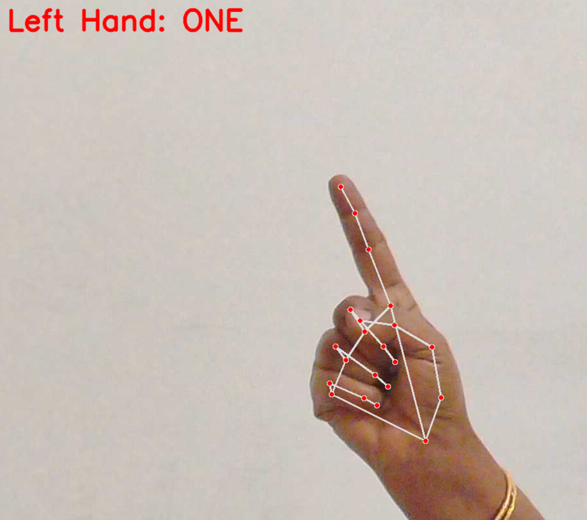 | 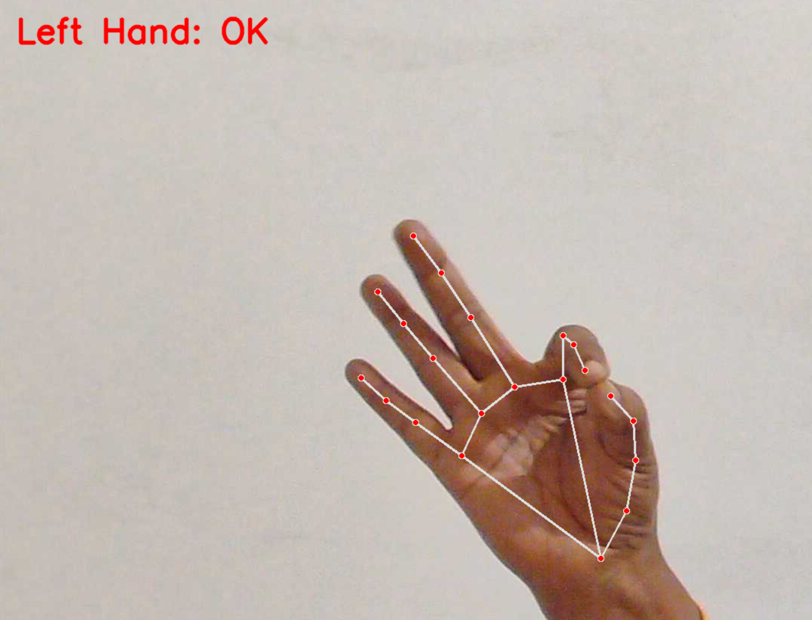 |
## 🛠️ Requirements

- Python 3.x
- OpenCV
- MediaPipe

### Install dependencies:

```bash
pip install opencv-python mediapipe
```

---

## 🚀 How to Run

Run the app from the `SignSense` root folder:

```bash
python app.py
```

- Press **`q`** to exit the webcam window.

---

## 📬 Contact the Developer

For more queries, feature requests, or bug reports, feel free to contact:

👨‍💻 **Jison Joseph Sebastian**  
🔗 [Contact me](https://myporfolio-1o1h.onrender.com/contact)
